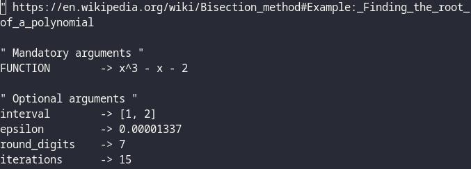
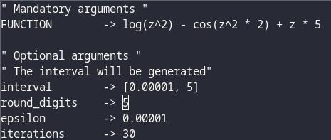

# AnsiBisection

AnsiBisection is a root finder of a single variable function using bisection
method, written in Python.

## Use

`python3 ~/AnsiBisection/src/main.py examples/example1.txt --graph`

Same as 

`python3 ~/AnsiBisection/src/main.py examples/example1.txt --graph --rounding_type=5 --precision=32`

# Output (x^3 - x - 2)
| Table result                      | Plotting of f(x)
| :---:  		                    | :---:    		
|     | 

## Features

- Stopping criteria by {Epsilon (|f(c)| <= e) or max iterations}
- Modifiable internal precision for float operations.
- Modifiable number of decimal digits each number must have after each float operation.
- 7 different modes of rounding a number.
- Descriptive table that shows each iteration of the method.
- Interval generator that start from (0, 0), (-1, +1), (-2, +2) up to (-100, +100)

## Requirements

- [Sympy](https://www.sympy.org/en/index.html) to express the single variable function on a file as a python object
- [Decimal](https://docs.python.org/3/library/decimal.html) to have internal precision and rounding.
- [Matplotlib](https://matplotlib.org) to graph f(x) and root on cartesian plane.
- Python >= 3.6

## Options
- `-h,   --help             → show this help message and exit`
- `-v,   --version          → show program's version number and exit`
- `-rt,  --rounding_type    → rounding modes:`
    - |0 -> ROUND_CEILING|
    - |1 -> ROUND_DOWN|
    - |2 -> ROUND_FLOOR|
    - |3 -> ROUND_HALF_DOWN|
    - |4 -> ROUND_HALF_EVEN|
    - |5 -> ROUND_HALF_UP|
    - |6 -> ROUND_UP|
    - |7 -> ROUND_05UP|
    - (default: 5)
- `-p,   --precision        → Number of digits when doing calculations, (default: 32)`
- `-g,   --graph            → Graph f(x) onto a cartesian plane (show's also root)`
- `-n,   --notation         → shows how to format the file, default values and exit`

## Note about formatting
file argument (mandatory)
Is a text file containing the mandatory single variable function argument
and optional arguments (epsilon, interval, iterations and round_digits)

# Examples of file formatting

| x^3 - x - 2               | log(z^2) - cos(z^2 * 2) + z * 5   | tan(sin(t)) + tan(cos(t)) |
| :---:  		            | :---:    			                | :---: 		            |
|  |          |  |

## Note about rounding
Each rounding is made at each operation (Calculating images, product of image and half point)
If half point is 3.5 it will be rounded to 4 (0 decimal after point)
Then f(c) will be calculated using the value of 3.5 rounded (4), f(4)

Other bisection method solvers doesn't do that, they round everything at the end.

If you don't like the behavior of rounding at each operation, here's a quickie solution: Increase the rounding digit to 1+ and then round it yourself.
## Made by [Sivefunc](https://gitlab.com/sivefunc)
## Licensed under [GPLv3](LICENSE)
